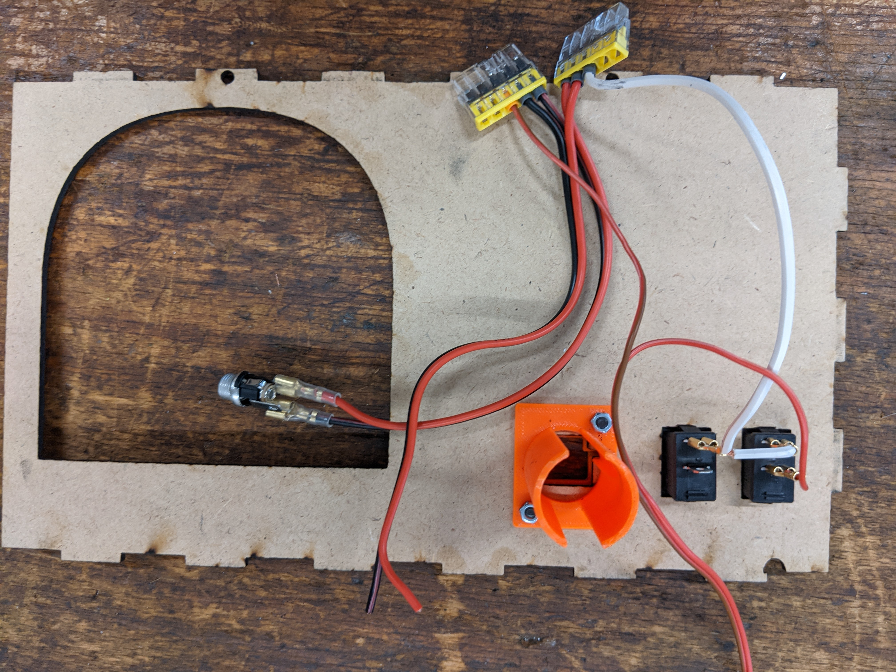

# SolderCase
a metal toolbox as an easy2built all-in-one soldering station. It has workplace lighting, solder fume exractor with filter, USB-C power dostribution for soldering irons like [Pinecil](https://pine64.com/product/pinecil-smart-mini-portable-soldering-iron/) or TS80, space for tools and a desk pad.

- [LaserCut Parts](#lasercut-parts)
- [3D-printed Parts](#3d-printed-parts)
- [Tools you need](#tools-you-need)
- [Preparation](#preparation)
- [Built](#built)
- [Wooden parts](#wooden-parts)
- [Electrical Installation](#electrical-installation)
- [Metal Toolbox](#metal-toolbox)
- [Finishing](#finishing)
- [Next Step](#next-step)
- [Credits](#credits)
- [Copyright and Authorship](#copyright-and-authorship)

---

## LaserCut Parts
The insert for the metal toolbox is made of 3mm thick mdf wood plates with size 560 x 500mm. The different colours stand for:

- Black: Cut part (line)
- Green: Engrave part (fill)
- Red:   ignore

Please adjust your laser cutter.

## 3D-printed Parts
The housing for the USB-PD converter can be found in the older "3Dprinted".
Printed in PLA with 0.2mm layer. Printed with the Prusa Mini +.
The cases for Pinecils was taken from https://www.thingiverse.com/thing:4571953.

## Tools you need
- side cutter
- needle nose pliers
- crimping tool
- solder iron
- wire stripper
- wood glue

## Preparation
Prepare the following wires with ferrules and cable lugs as shown in the picture below:
- all parts can be found in the BoM.xlsx / BoM.pdf
- [1] 15cm strand, 0,75mm^2, ferrule on one end and two (!) cable lugs (small) an the other
- [2] 15cm twin strand, 0.75mm^2, ferrules on both strands on one end and cable lugs on the other (for the barrel connector)
- [3] 15cm twin strand, 0.3mm^2, ferrule on only one end on the negative side (brown/black wire), and one cable lug on the positive side (red wire)
- [4] 15cm twin strand, 0.75mm^2, ferrules on both strands on one end (for the uSB-PD converter)
- [5] ferrule on negative side of the PC fan (brown/black wire) and cable lug on the positive side (red wire) (not shown in the picture)

## Built

### Wooden parts
- Use wood glue as shown in the picture; the front panel should not be glued (this is for maintenance)
- put in the two switches into the front panel
- attach the USB-PD housing with 2 screws M3x6 countersunk with nuts
- Prepare the PC fan: fan grille, PC fan (sticker should look through the grille), spacer, filter

  
   
  

### Electrical Installation
- after soldering the cables (twin strand as in [1]) put in the USB-PD converter and fix ith with the zip tie
- attach the cable lugs of the twin strand wirde [2] to the barrel connector
- solder the twin strand wire [4] to the LED band. Notice the polarity of the solder pads and the directionality of the LED-band itself!
- connect the remaining cables (positive side, red) from the LED band and the PC fan to the respective switches
- put all cables (positive and negative ones) into the two electrical installation clamps, one is for negative (GND) and one for positive (24V). On the positive clamp you should have the barrel connector (red), the switches, the USB-PD converter (red). On the negative one you should have the barrel connector (black), the LED-band (black), the PC-fan (black) and the the USB-PD converter (black)

  
   
  
  
  
  
  

### Metal Toolbox
- Prepare the metal toolbox as described in the file metalCaseDrilling\drillings.svg

### Finishing
- Put the whole insert into the metal toolbox
- drill the four corner holes (diameter 3-3.2mm) through the wooden parts
- attach the wooden insert by four screws M3x8mm using 8 washers and 4 nuts
- Put the barrel connector into place and screw it
- Close the front panel, check that no cables are cut or bruised
- Lock the front panel with the two screws M3x10 with two washers M3 and two nuts
- Connect the power supply; connect a solder iron to the USB-C connector from the USB-PD converter
- Check functionality of fan, LEDs, solder iron
- Using double-sided adhesive tape, attach the remaining MDF-plate to the lit; this is used as a pad inside the lit for soldering

## Next Step
Five of these SolderCases fit perfectly in a standard sized Eurobox (400x600x300mm) with enough space for one extra box containing some special tools, spare parts, etc.

---

## Credits
- Thanks to Exxess from the [Binary Kitchen e.V.](https://www.binary-kitchen.de/) for sharing the 3D-files
- Special thanks to [Timo](https://github.com/marove2000) from the [Binary Kitchen e.V.](https://www.binary-kitchen.de/) for discussions, tests and design considerations - and for bringing up these nice, cheap red metal cases

## Copyright and Authorship
This SolderCase is licenced under [CC-BY-SA 4.0](https://creativecommons.org/licenses/by-sa/4.0/) - [MINT-Labs Regensburg e.V.](https://www.mint-labs.de).
